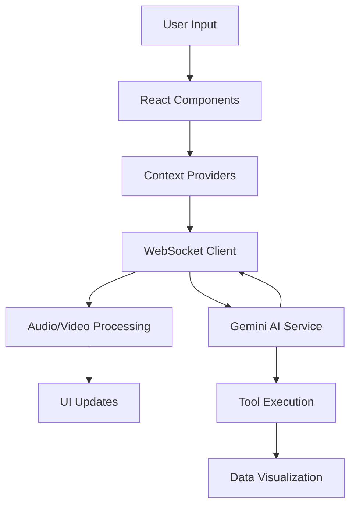
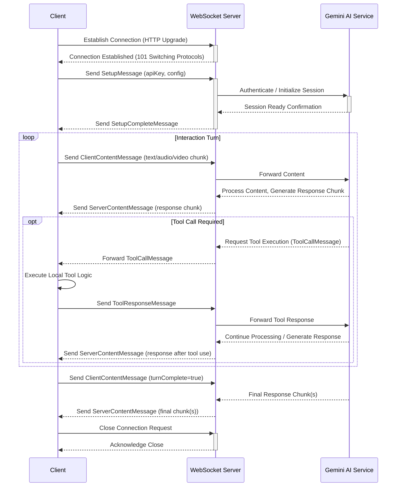

# Live API Web Console

A sophisticated React-based web application for real-time interaction with Gemini's AI model through WebSocket connections. This application provides a comprehensive suite of features including audio/video streaming, data visualization, and interactive AI communication capabilities.

## 🌟 Features

### Real-time Communication
- 🎤 Bi-directional audio streaming with advanced processing
- 📹 Multi-source video input (webcam and screen capture)
- 💬 Interactive chat interface with streaming responses
- 🔄 Real-time WebSocket connection management

### Data Visualization
- 📊 Interactive Altair/Vega-Lite charts
- 📈 Real-time data updates
- 🎨 Customizable themes and styles
- 📱 Responsive design across devices

### Advanced Tools
- 📝 Document generation (PDF, DOCX, HTML)
- 📨 Email composition and sending
- 🖼️ Image search and generation
- 🔍 Visual content analysis
## 🏗 Architecture Overview

### Core Architecture Components

1. **WebSocket Communication Layer**
   - Bi-directional streaming using native WebSocket API
   - Automatic reconnection handling
   - Message queuing and retry logic
   - Custom protocol implementation for Gemini AI

2. **Audio Processing Pipeline**
   - Utilizes `AudioWorklet` for efficient, non-blocking audio processing off the main thread.
   - Captures audio via `getUserMedia`, processes it in real-time, encodes it (e.g., PCM 16-bit mono @ 16kHz), and streams it over WebSocket.
   - Includes real-time volume metering for UI feedback.
   - Manages buffering to balance latency and smoothness.
   - Handles playback of incoming audio streams from the server.

```mermaid
graph LR
    subgraph "Client: Capture & Send"
        A[Audio Input Device] --> B(getUserMedia);
        B --> C(AudioContext);
        C --> D{Audio Processing Worklet};
        D -- Raw Audio Floats --> E[PCM Encoding];
        D -- Volume Data --> UI_V[UI Volume Meter];
        E --> F(Buffer Management);
        F --> G[WebSocket Send Chunks];
    end
    subgraph "Server & AI"
        H[WebSocket Receive] --> I{Server Audio Processing};
        I --> J[Gemini AI Service];
        J --> K[Response Generation (incl. Audio)];
        K --> L[WebSocket Send Response];
    end
    subgraph "Client: Receive & Playback"
        M[WebSocket Receive] --> N{Audio Decoding};
        N --> O(Playback Buffer);
        O --> P[Audio Output Device];
    end
    G --> H;
    L --> M;
```

3. **Video Processing Pipeline**
   - Supports webcam and screen capture inputs via `getUserMedia` and `getDisplayMedia`.
   - Captures frames periodically using a canvas element.
   - Encodes frames (e.g., JPEG) with configurable quality for bandwidth management.
   - Streams encoded frames over WebSocket.
   - Handles potential resolution changes and aspect ratio adjustments.

```mermaid
graph LR
    subgraph "Client: Capture & Send"
        A[Video Source (Webcam/Screen)] --> B(getUserMedia/getDisplayMedia);
        B --> C(HTMLVideoElement);
        C --> D{Frame Capture (Canvas)};
        D --> E[Image Encoding (JPEG/PNG)];
        E --> F(Quality/Bandwidth Control);
        F --> G[WebSocket Send Frames];
    end
    subgraph "Server & AI"
        H[WebSocket Receive] --> I{Server Frame Processing};
        I --> J[Gemini AI Service (Vision)];
        J --> K[Response Generation];
        K --> L[WebSocket Send Response];
    end
    subgraph "Client: Display & Control"
        M[WebSocket Receive] --> N[UI Update/Response Display];
        UI_C[UI Controls] --> A;
        UI_C --> F;
    end
    G --> H;
    L --> M;
```
   - Streams encoded frames over WebSocket.
   - Handles potential resolution changes and aspect ratio adjustments.

```mermaid
graph LR
    subgraph "Client: Capture & Send"
        A[Video Source (Webcam/Screen)] --> B(getUserMedia/getDisplayMedia);
        B --> C(HTMLVideoElement);
        C --> D{Frame Capture (Canvas)};
        D --> E[Image Encoding (JPEG/PNG)];
        E --> F(Quality/Bandwidth Control);
        F --> G[WebSocket Send Frames];
    end
    subgraph "Server & AI"
        H[WebSocket Receive] --> I{Server Frame Processing};
        I --> J[Gemini AI Service (Vision)];
        J --> K[Response Generation];
        K --> L[WebSocket Send Response];
    end
    subgraph "Client: Display & Control"
        M[WebSocket Receive] --> N[UI Update/Response Display];
        UI_C[UI Controls] --> A;
        UI_C --> F;
    end
    G --> H;
    L --> M;
```

4. **State Management**
   - React Context for global state
   - Local component state for UI elements
   - WebSocket connection state
   - Media stream states

### Data Flow Architecture



### Component Communication
Components primarily interact through the `LiveAPIContext` for WebSocket-related state and actions, and potentially custom event emitters or state management libraries (like Zustand for the logger) for other cross-component communication.

```mermaid
graph TD
    subgraph UI Layer
        UserInput[User Interaction (e.g., Button Click)] --> Comp(React Component);
    end
    subgraph State & Logic Layer
        Comp --> Hook{Custom Hook (e.g., useLiveAPI)};
        Hook --> Ctx(LiveAPIContext);
        Ctx --> Client(MultimodalLiveClient Instance);
        Client -- Emits Events (e.g., 'content', 'audio') --> Ctx;
        Ctx -- Updates State --> Hook;
        Hook -- Provides State/Callbacks --> Comp;
    end
    subgraph WebSocket Layer
        Client -- Sends/Receives Messages --> WS(WebSocket Connection);
        WS -- Relays Messages --> Client;
    end
    subgraph Tool Layer
        Client -- Handles Tool Calls --> Tool(Tool Execution Logic);
        Tool -- Sends Responses --> Client;
    end
    Comp --> Render(UI Update / Re-render);
```

1. **Event System**
Components primarily interact through the `LiveAPIContext` for WebSocket-related state and actions, and potentially custom event emitters or state management libraries (like Zustand for the logger) for other cross-component communication.

```mermaid
graph TD
    subgraph UI Layer
        UserInput[User Interaction (e.g., Button Click)] --> Comp(React Component);
    end
    subgraph State & Logic Layer
        Comp --> Hook{Custom Hook (e.g., useLiveAPI)};
        Hook --> Ctx(LiveAPIContext);
        Ctx --> Client(MultimodalLiveClient Instance);
        Client -- Emits Events (e.g., 'content', 'audio') --> Ctx;
        Ctx -- Updates State --> Hook;
        Hook -- Provides State/Callbacks --> Comp;
    end
    subgraph WebSocket Layer
        Client -- Sends/Receives Messages --> WS(WebSocket Connection);
        WS -- Relays Messages --> Client;
    end
    subgraph Tool Layer
        Client -- Handles Tool Calls --> Tool(Tool Execution Logic);
        Tool -- Sends Responses --> Client;
    end
    Comp --> Render(UI Update / Re-render);
```

1. **Event System**

1. **Event System**
```typescript
interface EventSystem {
  emit(event: string, data: any): void;
  on(event: string, callback: (data: any) => void): void;
  off(event: string, callback: (data: any) => void): void;
}
```

2. **Message Protocol**
```typescript
interface Message {
  type: MessageType;
  payload: any;
  metadata: {
    timestamp: number;
    sessionId: string;
    priority: Priority;
  };
}
```

### Performance Optimizations

1. **Audio Processing**
   - Worklet-based processing for off-main-thread computation
   - Efficient PCM encoding/decoding
   - Smart buffering strategies

2. **Video Handling**
   - Frame rate optimization
   - Quality/bandwidth tradeoffs
   - Hardware acceleration when available

3. **Memory Management**
   - Stream cleanup on disconnection
   - Automatic garbage collection
   - Resource pooling

### User Interface
- 🌙 Professional dark theme
- 📋 Comprehensive logging system
- 🎛️ Intuitive control panel
- 🎯 Tool integration interface

## 📁 Project Structure

```
live-api-web-console/
├── public/
│   ├── index.html              # Main HTML template
│   ├── favicon.ico             # Site favicon
│   └── robots.txt              # Robots configuration
├── src/
│   ├── components/             # React components
│   │   ├── altair/            # Data visualization components
│   │   │   └── Altair.tsx     # Main visualization component
│   │   ├── audio-pulse/       # Audio visualization
│   │   │   ├── AudioPulse.tsx
│   │   │   └── audio-pulse.scss
│   │   ├── control-tray/      # Media controls
│   │   │   ├── ControlTray.tsx
│   │   │   └── control-tray.scss
│   │   ├── email-preview/     # Email functionality
│   │   ├── image-display/     # Image handling
│   │   ├── logger/            # Logging system
│   │   ├── report-preview/    # Report generation
│   │   ├── search-results/    # Search functionality
│   │   └── side-panel/        # Main control panel
│   ├── contexts/              # React contexts
│   │   └── LiveAPIContext.tsx # WebSocket state management
│   ├── hooks/                # Custom React hooks
│   │   ├── use-live-api.ts   # API integration hook
│   │   ├── use-media-stream-mux.ts
│   │   ├── use-screen-capture.ts
│   │   └── use-webcam.ts
│   ├── lib/                  # Core utilities
│   │   ├── audio-recorder.ts
│   │   ├── audio-streamer.ts
│   │   ├── audioworklet-registry.ts
│   │   ├── multimodal-live-client.ts
│   │   ├── store-logger.ts
│   │   ├── tool-declarations.ts
│   │   └── utils.ts
│   ├── worklets/            # Audio processing worklets
│   │   ├── audio-processing.ts
│   │   └── vol-meter.ts
│   ├── App.tsx             # Main application component
│   ├── App.scss            # Global styles
│   └── index.tsx          # Application entry point
├── .env                   # Environment configuration
├── package.json          # Dependencies and scripts
└── tsconfig.json        # TypeScript configuration
```

## 🔧 Technical Details

### Key Dependencies

```json
{
  "dependencies": {
    "@google/generative-ai": "^0.1.0",
    "eventemitter3": "^5.0.0",
    "react": "^18.2.0",
    "vega-embed": "^6.22.0",
    "zustand": "^4.4.0",
    "classnames": "^2.3.0",
    "react-select": "^5.0.0"
  }
}
```

### Component Architecture

#### AudioRecorder Class
```typescript
class AudioRecorder extends EventEmitter {
  constructor(sampleRate = 16000) {
    super();
    this.sampleRate = sampleRate;
  }

  // Key methods
  async start(): Promise<void>
  stop(): void
  // Event emissions: 'data', 'volume'
}
```

#### LiveAPIClient Class
```typescript
class MultimodalLiveClient extends EventEmitter<MultimodalLiveClientEventTypes> {
  constructor({ url, apiKey }: MultimodalLiveAPIClientConnection)
  connect(config: LiveConfig): Promise<boolean>
  disconnect(): void
  send(parts: Part | Part[], turnComplete?: boolean): void
  // Event handling for: 'open', 'close', 'audio', 'content', etc.
}
```

### WebSocket Protocol
Illustrative sequence of messages exchanged during a typical session:


Illustrative sequence of messages exchanged during a typical session:


```typescript
// Outgoing messages
type OutgoingMessage = 
  | SetupMessage 
  | ClientContentMessage
  | RealtimeInputMessage
  | ToolResponseMessage;

// Incoming messages
type IncomingMessage =
  | ServerContentMessage
  | ToolCallMessage
  | SetupCompleteMessage;
```

### Audio Processing Pipeline

1. **Input Processing**
```typescript
// Sample rate conversion
sampleRate: 16000 // Hz
bitDepth: 16 // bits
channels: 1 // mono
```

2. **Worklet Processing**
```typescript
// Audio processing worklet
class AudioProcessingWorklet extends AudioWorkletProcessor {
  process(inputs: Float32Array[][]): boolean
  processChunk(float32Array: Float32Array): void
}
```

### State Management
State is managed through a combination of React Context for global WebSocket and connection state, Zustand for specific stores like logging, and local component state for UI concerns.

```mermaid
graph TD
    App --> LP(LiveAPIProvider);
    App --> ZP(Zustand Provider - Implicit);

    subgraph Components
        C1[ControlTray]
        C2[SidePanel / Logger]
        C3[AudioPulse]
        C4[Other UI Components]
    end

    LP -- useContext(LiveAPIContext) --> C1;
    LP -- useContext(LiveAPIContext) --> C2;
    LP -- useContext(LiveAPIContext) --> C3;
    LP -- useContext(LiveAPIContext) --> C4;

    ZP -- useStore(useLoggerStore) --> C2;
    ZP -- useStore(...) --> C4;

    C1 -- Reads/Updates --> LC[LiveAPIContext State (connected, client, config, volume)];
    C2 -- Reads/Updates --> LC;
    C3 -- Reads --> LC;
    C4 -- Reads/Updates --> LC;

    C2 -- Reads/Updates --> ZS[Zustand LoggerStore State (logs)];
    C4 -- Reads/Updates --> ZS;

    LC --> WSC[MultimodalLiveClient];
    WSC -- Events Update --> LC;
```

1. **Global State (Context)**
State is managed through a combination of React Context for global WebSocket and connection state, Zustand for specific stores like logging, and local component state for UI concerns.

```mermaid
graph TD
    App --> LP(LiveAPIProvider);
    App --> ZP(Zustand Provider - Implicit);

    subgraph Components
        C1[ControlTray]
        C2[SidePanel / Logger]
        C3[AudioPulse]
        C4[Other UI Components]
    end

    LP -- useContext(LiveAPIContext) --> C1;
    LP -- useContext(LiveAPIContext) --> C2;
    LP -- useContext(LiveAPIContext) --> C3;
    LP -- useContext(LiveAPIContext) --> C4;

    ZP -- useStore(useLoggerStore) --> C2;
    ZP -- useStore(...) --> C4;

    C1 -- Reads/Updates --> LC[LiveAPIContext State (connected, client, config, volume)];
    C2 -- Reads/Updates --> LC;
    C3 -- Reads --> LC;
    C4 -- Reads/Updates --> LC;

    C2 -- Reads/Updates --> ZS[Zustand LoggerStore State (logs)];
    C4 -- Reads/Updates --> ZS;

    LC --> WSC[MultimodalLiveClient];
    WSC -- Events Update --> LC;
```

1. **Global State (Context)**

1. **Global State (Context)**
```typescript
interface LiveAPIContext {
  client: MultimodalLiveClient;
  connected: boolean;
  config: LiveConfig;
  volume: number;
  connect(): Promise<void>;
  disconnect(): Promise<void>;
}
```

2. **Logger Store (Zustand)**
```typescript
interface LoggerStore {
  maxLogs: number;
  logs: StreamingLog[];
  log(streamingLog: StreamingLog): void;
  clearLogs(): void;
}
```

### Security Considerations

1. **API Key Management**
- Environment-based configuration
- Runtime validation
- Secure storage practices

2. **Data Handling**
- Sanitized inputs
- Secure WebSocket connections
- Error boundary implementation

### Performance Optimizations

1. **Audio Processing**
- Worklet-based processing
- Efficient buffer management
- Adaptive quality control

2. **Memory Management**
- Resource cleanup
- Stream termination
- Garbage collection optimization

3. **UI Performance**
- React memo usage
- Callback optimization
- Efficient re-rendering
## 🚀 Getting Started

### Prerequisites

- Node.js (v14.x or higher)
- NPM (v6.x or higher) or Yarn (v1.22.x or higher)
- A valid Gemini API key
- Modern web browser (Chrome recommended)

### System Requirements
- Minimum 4GB RAM
- Modern multi-core processor
- Webcam and microphone (for media features)
- Stable internet connection

### Installation

1. Clone the repository:
```bash
git clone <repository-url>
cd live-api-web-console
```

2. Install dependencies:
```bash
npm install
# Note: If adding features like Markdown rendering or HTML sanitization, you might need:
npm install marked dompurify @types/marked @types/dompurify
# or with Yarn
yarn install
```

3. Configure environment:
   Create a `.env` file in the root directory:
```env
REACT_APP_GEMINI_API_KEY=your_api_key_here
# Optional configurations
REACT_APP_WS_URL=your_websocket_url
REACT_APP_API_BASE_URL=your_api_base_url
```

4. Start development server:
```bash
npm start
# or with Yarn
yarn start
```

## 🏗️ Architecture

### Core Components

#### 1. LiveAPIProvider
The central context provider managing WebSocket connections and state:
```tsx
<LiveAPIProvider
  url={uri}
  apiKey={API_KEY}
  options={{
    reconnect: true,
    reconnectInterval: 3000,
    maxReconnectAttempts: 5
  }}
>
  {/* App components */}
</LiveAPIProvider>
```

#### 2. Control Tray
Advanced media control interface:
```typescript
interface ControlTrayProps {
  videoRef: RefObject<HTMLVideoElement>;
  supportsVideo: boolean;
  onVideoStreamChange?: (stream: MediaStream | null) => void;
  children?: ReactNode;
}
```

Features:
- Microphone input control with volume visualization
- Screen capture with resolution options
- Webcam toggle with device selection
- Connection status management

#### 3. Side Panel
Comprehensive logging and interaction interface:
- Filterable message display
- Real-time updates
- Collapsible interface
- Custom log levels

#### 4. Altair Visualization
Professional data visualization component:
```typescript
interface AltairProps {
  data: any;
  spec: VegaLiteSpec;
  theme?: 'dark' | 'light';
  options?: EmbedOptions;
}
```

2. **Audio Processing Pipeline**
   - Utilizes `AudioWorklet` for efficient, non-blocking audio processing off the main thread.
   - Captures audio via `getUserMedia`, processes it in real-time, encodes it (e.g., PCM 16-bit mono @ 16kHz), and streams it over WebSocket.
   - Includes real-time volume metering for UI feedback.
   - Manages buffering to balance latency and smoothness.
   - Handles playback of incoming audio streams from the server.

```mermaid
graph LR
    subgraph "Client: Capture & Send"
        A[Audio Input Device] --> B(getUserMedia);
        B --> C(AudioContext);
        C --> D{Audio Processing Worklet};
        D -- Raw Audio Floats --> E[PCM Encoding];
        D -- Volume Data --> UI_V[UI Volume Meter];
        E --> F(Buffer Management);
        F --> G[WebSocket Send Chunks];
    end
    subgraph "Server & AI"
        H[WebSocket Receive] --> I{Server Audio Processing};
        I --> J[Gemini AI Service];
        J --> K[Response Generation (incl. Audio)];
        K --> L[WebSocket Send Response];
    end
    subgraph "Client: Receive & Playback"
        M[WebSocket Receive] --> N{Audio Decoding};
        N --> O(Playback Buffer);
        O --> P[Audio Output Device];
    end
    G --> H;
    L --> M;
```

#### Audio Playback
- Buffered streaming
- Adaptive quality control
- Cross-browser compatibility
- Error recovery

## 🛠️ Available Tools

### 1. Report Generation
```typescript
interface ReportOptions {
  title: string;
  content: string;
  format: "pdf" | "docx" | "html";
  metadata?: {
    author?: string;
    created?: Date;
    tags?: string[];
  };
  styling?: {
    template?: string;
    font?: string;
    colors?: ColorScheme;
  };
}
```

### 2. Email System
```typescript
interface EmailOptions {
  to: string;
  from: string;
  subject: string;
  body: string;
  attachments?: Attachment[];
  cc?: string[];
  bcc?: string[];
  template?: EmailTemplate;
}
```

### 3. Image Operations
```typescript
interface ImageSearchOptions {
  query: string;
  num_results?: number;
  filters?: {
    size?: ImageSize;
    type?: ImageType;
    color?: ColorFilter;
  };
}

interface ImageGenerationOptions {
  prompt: string;
  style?: "natural" | "artistic" | "photographic";
  size?: "1024x1024" | "512x512" | "256x256";
  parameters?: {
    strength?: number;
    noise?: number;
    steps?: number;
  };
}
```

## 🎨 Styling System

### Theme Configuration
```typescript
interface ThemeConfig {
  colors: {
    primary: string;
    secondary: string;
    background: string;
    text: string;
    accent: string[];
  };
  spacing: {
    unit: number;
    scale: number[];
  };
  typography: {
    fontFamily: string;
    fontSize: {
      base: number;
      scale: number[];
    };
  };
}
```

### CSS Variables
```scss
:root {
  --text: white;
  --gray-200: #b4b8bb;
  --gray-300: #80868b;
  // ... other variables
}
```

## 🔧 Advanced Configuration

### WebSocket Configuration
```typescript
interface WSConfig {
  reconnection: {
    enabled: boolean;
    maxAttempts: number;
    delay: number;
  };
  heartbeat: {
    enabled: boolean;
    interval: number;
    timeout: number;
  };
  compression?: 'none' | 'gzip' | 'deflate';
}
```

### Audio Configuration
```typescript
interface AudioConfig {
  sampleRate: number;
  channels: number;
  bitDepth: number;
  codec: AudioCodec;
  bufferSize: number;
}
```

## 🔍 Error Handling

### WebSocket Errors
- Connection failures
- Timeout handling
- Reconnection logic
- Message queue management

### Media Errors
- Device access failures
- Stream interruptions
- Format compatibility
- Resource constraints

## 📱 Browser Compatibility

| Browser | Version | Support Level |
|---------|---------|--------------|
| Chrome  | 80+     | Full         |
| Firefox | 75+     | Full         |
| Safari  | 13+     | Partial      |
| Edge    | 80+     | Full         |

## 🏗️ Development

### Project Structure
```
src/
├── components/        # React components
│   ├── altair/       # Visualization components
│   ├── audio/        # Audio processing components
│   ├── control/      # UI control components
│   └── shared/       # Reusable components
├── contexts/         # React contexts
├── hooks/           # Custom React hooks
├── lib/             # Utility functions
│   ├── audio/       # Audio processing utilities
│   ├── network/     # Network handling
│   └── tools/       # Tool implementations
├── worklets/        # Audio worklets
└── types/           # TypeScript definitions
```

### Key Files
- `App.tsx`: Application entry point
- `LiveAPIContext.tsx`: WebSocket management
- `multimodal-live-client.ts`: Core client implementation
- `audio-streamer.ts`: Audio processing
- `tool-declarations.ts`: Available tools

## 🚀 Deployment

### Production Build
```bash
# Build optimization
npm run build
# or
yarn build

# Environment configuration
NODE_ENV=production
REACT_APP_API_TIMEOUT=30000
REACT_APP_WS_RECONNECT_ATTEMPTS=3
```

### Docker Deployment
```dockerfile
FROM node:16-alpine as builder
WORKDIR /app
COPY package*.json ./
RUN npm install
COPY . .
RUN npm run build

FROM nginx:alpine
COPY --from=builder /app/build /usr/share/nginx/html
EXPOSE 80
CMD ["nginx", "-g", "daemon off;"]
```

### Performance Monitoring
- Integration with Performance API
- Custom metrics tracking
- Error reporting
- Usage analytics

### Security Considerations
- WebSocket connection encryption
- API key management
- Input sanitization
- Rate limiting
## 👨‍💻 Development Guidelines

### Code Style

1. **TypeScript Best Practices**
```typescript
// Use strict typing
interface Props {
  value: string;
  onChange: (value: string) => void;
}

// Prefer functional components
const Component: React.FC<Props> = ({ value, onChange }) => {
  // Implementation
};
```

2. **Component Structure**
```typescript
// Component folder structure
ComponentName/
├── index.tsx        // Main component
├── component.scss   // Styles
├── types.ts         // Type definitions
└── utils.ts         // Helper functions
```

3. **Testing Guidelines**
```typescript
describe('ComponentName', () => {
  it('should render correctly', () => {
    // Test implementation
  });
  
  it('should handle user interactions', () => {
    // Test implementation
  });
});
```

### Git Workflow
A standard feature-branch workflow is recommended:

```mermaid
 graph LR
    A[main / production] --> B(git checkout -b feature/feature-name);
    B --> C{Develop Feature};
    C --> D(git add .);
    D --> E(git commit -m "feat: Describe feature");
    E --> F(git push origin feature/feature-name);
    F --> G{Create Pull Request on GitHub/GitLab};
    G -- Code Review & CI Checks --> H{Merge PR};
    H --> A;
    A --> I(Deploy);

    subgraph Hotfix Workflow
       direction LR
       A --> HF1(git checkout -b hotfix/bug-fix);
       HF1 --> HF2{Fix Critical Bug};
       HF2 --> HF3(git commit -m "fix: Describe fix");
       HF3 --> HF4(git push origin hotfix/bug-fix);
       HF4 --> HF5{Create PR};
       HF5 -- Expedited Review --> HF6{Merge PR};
       HF6 --> A;
       HF6 --> I;
    end
```

1. **Branch Naming**
A standard feature-branch workflow is recommended:

```mermaid
 graph LR
    A[main / production] --> B(git checkout -b feature/feature-name);
    B --> C{Develop Feature};
    C --> D(git add .);
    D --> E(git commit -m "feat: Describe feature");
    E --> F(git push origin feature/feature-name);
    F --> G{Create Pull Request on GitHub/GitLab};
    G -- Code Review & CI Checks --> H{Merge PR};
    H --> A;
    A --> I(Deploy);

    subgraph Hotfix Workflow
       direction LR
       A --> HF1(git checkout -b hotfix/bug-fix);
       HF1 --> HF2{Fix Critical Bug};
       HF2 --> HF3(git commit -m "fix: Describe fix");
       HF3 --> HF4(git push origin hotfix/bug-fix);
       HF4 --> HF5{Create PR};
       HF5 -- Expedited Review --> HF6{Merge PR};
       HF6 --> A;
       HF6 --> I;
    end
```

1. **Branch Naming**

1. **Branch Naming**
```bash
feature/component-name
bugfix/issue-description
refactor/area-of-change
```

2. **Commit Messages**
```bash
feat: Add new feature
fix: Resolve bug
refactor: Improve code structure
docs: Update documentation
```

### Documentation Standards

1. **Component Documentation**
```typescript
/**
 * ComponentName - Description
 * 
 * @component
 * @example
 * ```tsx
 * <ComponentName prop="value" />
 * ```
 */
```

2. **Function Documentation**
```typescript
/**
 * Function description
 * 
 * @param {type} paramName - Parameter description
 * @returns {type} Return value description
 * @throws {ErrorType} Error description
 */
```

### Performance Guidelines

1. **React Performance**
- Use React.memo for pure components
- Implement useMemo for expensive calculations
- Utilize useCallback for function props

2. **Media Handling**
- Implement proper cleanup in useEffect
- Handle device disconnections
- Manage memory usage

3. **Error Handling**
- Implement error boundaries
- Log errors appropriately
- Provide user feedback
## 📜 License

Licensed under the Apache License, Version 2.0. See [LICENSE](LICENSE) file for details.

## 🤝 Contributing

### Development Process
1. Fork the repository
2. Create your feature branch (`git checkout -b feature/AmazingFeature`)
3. Commit your changes (`git commit -m 'Add some AmazingFeature'`)
4. Push to the branch (`git push origin feature/AmazingFeature`)
5. Open a Pull Request

### Code Style
- Follow TypeScript best practices
- Use functional components
- Maintain consistent naming conventions
- Include appropriate documentation
- Add unit tests for new features

## 🔧 Troubleshooting

### Common Issues

1. **WebSocket Connection Failures**
```typescript
// Check connection status
if (ws.readyState !== WebSocket.OPEN) {
  console.error('WebSocket not connected');
}
```

2. **Audio/Video Permission Issues**
```javascript
// Request permissions explicitly
async function requestMediaPermissions() {
  try {
    await navigator.mediaDevices.getUserMedia({ audio: true, video: true });
  } catch (error) {
    console.error('Media permission denied:', error);
  }
}
```

3. **Performance Issues**
- Clear browser cache
- Check network latency
- Monitor memory usage
- Verify hardware acceleration

### Debug Mode
```typescript
// Enable debug logging
const DEBUG_MODE = true;
if (DEBUG_MODE) {
  window.__DEBUG__ = {
    wsMessages: [],
    audioMetrics: {},
    videoMetrics: {}
  };
}
```
## 💬 Support

For support and questions:
- Create an issue in the repository
- Join our Discord community
- Check the documentation
- Contact the development team

## 📚 Additional Resources

- [API Documentation](docs/api.md)
- [Development Guide](docs/development.md)
- [Contributing Guidelines](CONTRIBUTING.md)
- [Change Log](CHANGELOG.md)
